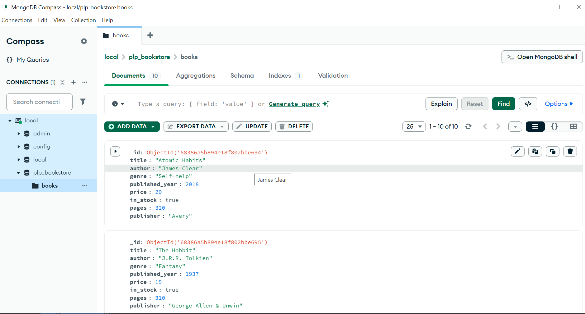

[](https://classroom.github.com/online_ide?assignment_repo_id=19656901&assignment_repo_type=AssignmentRepo)
# MongoDB Fundamentals Assignment

## Overview

This assignment demonstrates my understanding of MongoDB fundamentals, including:

- MongoDB setup and configuration
- Creating databases and collections
- Performing basic CRUD operations
- Writing advanced queries with filtering, projection, sorting, and pagination
- Using aggregation pipelines for data analysis
- Implementing indexing for performance optimization

## Setup Instructions

### Prerequisites

- Node.js v18 or higher installed
- MongoDB Community Edition installed locally **OR** a MongoDB Atlas account set up
- MongoDB Shell (`mongosh`) or MongoDB Compass installed

### Installation and Setup

1. Clone this repository:
   ```bash
   git clone https://github.com/PLP-MERN-Stack-Development/week-1-mongodb-fundamentals-assignment-ValerieMbaka.git
   cd week-1-mongodb-fundamentals-assignment-ValerieMbaka
   ```

2. Install dependencies (if any, currently none needed for running the script):
   ```bash
   npm install
   ```

3. Make sure MongoDB is running locally or connect to your Atlas cluster.

4. Run the script to insert sample book data into the `plp_bookstore` database:
   ```bash
   node insert_books.js
   ```

5. Use the queries in `queries.js` to perform CRUD operations, advanced queries, aggregation, and indexing.

## Files Included

- `insert_books.js`: Script to populate the MongoDB `books` collection with sample data.
- `queries.js`: Contains all MongoDB queries written for the assignment covering basic CRUD, advanced filtering, aggregation pipelines, and indexing.
- `README.md`: This file with setup instructions and assignment overview.

## Sample Data

The `books` collection contains books with the following fields:

- `title` (string)
- `author` (string)
- `genre` (string)
- `published_year` (number)
- `price` (number)
- `in_stock` (boolean)
- `pages` (number)
- `publisher` (string)

## How to Run

1. Ensure MongoDB service is running.
2. Run the data insertion script with:
   ```bash
   node insert_books.js
   ```
3. Open MongoDB Shell (`mongosh`) or MongoDB Compass.
4. Execute the queries from `queries.js` in the shell or Compass query tab to see the results.

## Screenshot

Include a screenshot of your MongoDB Compass or Atlas view showing the `books` collection with sample data. Save it as `screenshots/mongodb_books_collection.png` in this repository.

Example:



## Notes

- Indexes were created on `title` and a compound index on `author` and `published_year` fields to optimize query performance.
- The `explain()` method was used on queries to demonstrate performance improvements due to indexing.

---